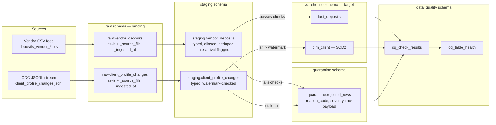

# Part 1 — Pipeline Design & Reconciliation

Platform: **PostgreSQL**, orchestrated by **Airflow** (dbt is deferred — transformations are
plain SQL executed by Airflow operators for now; dbt can be layered in on top of the same
`staging` → `warehouse` SQL later without changing the schema design below).

---

## 1. Architecture Overview

Four Postgres schemas, one per layer. Every row that enters the pipeline ends up in exactly
one of `staging`, `warehouse`, or `quarantine` — nothing is silently dropped.



**What happens at each layer:**

| Layer | Purpose | Vendor CSV specifics | CDC JSONL specifics |
|---|---|---|---|
| `raw` | Landing zone. Load the file byte-for-byte as text/jsonb columns, no type coercion, no business logic. Tag every row with `_source_file` and `_ingested_at`. | One `COPY` per file into `raw.vendor_deposits`. Column-name drift (`method` vs `payment_method`) is **not** resolved here — raw keeps the source's own column names. | One row per JSONL line loaded into `raw.client_profile_changes` as a `jsonb` column plus `_source_file`/`_ingested_at`. |
| `staging` | Type casting, column-alias normalization, deduplication, and the only place business rules run (late-arrival flagging, watermark checks). Every row leaving `staging` is destined for either `warehouse` or `quarantine` — never left in `staging` unresolved. | Alias map resolves `method` → `payment_method`. `ON CONFLICT` on `deposit_id` handles the `VDEP002`/`VDEP005` re-delivery. `deposit_date` vs `_ingested_at` comparison sets `is_late_arrival`. | `after` JSON fields are cast to typed columns. Row is compared against `cdc_watermark.last_applied_lsn` for that `client_id`; stale rows are quarantined instead of applied. |
| `warehouse` | The Kimball star (Part 2). Only validated, deduplicated, correctly-ordered data lands here. | Upserted into `fact_deposits` by `deposit_id`. | Applied to `dim_client` as a new SCD2 version row (update/insert) or an end-date + tombstone (delete). |
| `quarantine` | Explicit holding area for anything that fails a check, with a reason code and severity — never a silent drop. | Negative amounts, malformed rows (see §5). | Stale-LSN rows, malformed JSON records. |

Airflow DAG shape: `land_files → validate_and_stage → apply_to_warehouse` for the vendor feed,
and a parallel `land_cdc → validate_and_stage_cdc → apply_scd2` for the CDC stream, both
followed by a shared `run_data_quality_checks` task. A separate, independently-scheduled
`reconcile_vendor_feed` DAG runs daily (§3).

---

## 2. Idempotency Strategy

**Mechanism: natural key + `ON CONFLICT`, applied differently per source.** No file-manifest
layer — the natural key alone is sufficient because every source row already carries one
(`deposit_id` for deposits, `client_id` + `lsn` for CDC events), and checking it costs one
indexed lookup per row rather than an extra bookkeeping table to maintain.

- **Vendor deposits**: `ON CONFLICT (deposit_id) DO UPDATE` — mutable fields (`status`,
  `fee_usd`) are genuinely correctable on re-delivery, so a repeat delivery with a changed
  value should update in place.
- **CDC events**: `ON CONFLICT (client_id, source_lsn) DO NOTHING` — an SCD2 apply inserts a
  new *version* row per change; there's nothing to "update in place" for an already-applied
  `lsn`, since a retroactive correction to history is a different operation (see Part 2b.3),
  not a simple upsert.

```sql
-- Vendor deposits: re-running the same file (or an overlapping later file, like
-- VDEP002/VDEP005 reappearing in both 0301 and 0302) is a no-op or a clean update.
INSERT INTO staging.vendor_deposits (deposit_id, client_id, deposit_date, amount_usd,
                                      payment_method, currency_original, exchange_rate,
                                      status, processing_days, fee_usd, is_late_arrival)
VALUES (%(deposit_id)s, %(client_id)s, %(deposit_date)s, %(amount_usd)s,
        %(payment_method)s, %(currency_original)s, %(exchange_rate)s,
        %(status)s, %(processing_days)s, %(fee_usd)s, %(is_late_arrival)s)
ON CONFLICT (deposit_id) DO UPDATE
    SET status = EXCLUDED.status,
        fee_usd = EXCLUDED.fee_usd,
        _ingested_at = EXCLUDED._ingested_at
    WHERE staging.vendor_deposits.status IS DISTINCT FROM EXCLUDED.status
       OR staging.vendor_deposits.fee_usd IS DISTINCT FROM EXCLUDED.fee_usd;
```

```sql
-- CDC apply: source of idempotency is (client_id, source_lsn) uniqueness on the SCD2
-- table itself. Replaying the same lsn event twice inserts nothing the second time.
ALTER TABLE warehouse.dim_client ADD CONSTRAINT uq_client_lsn UNIQUE (client_id, source_lsn);

INSERT INTO warehouse.dim_client (client_id, risk_category, account_balance_usd,
                                   account_status, valid_from, valid_to, is_current,
                                   is_deleted, source_lsn)
VALUES (%(client_id)s, %(risk_category)s, %(account_balance_usd)s, %(account_status)s,
        %(commit_ts)s, '9999-12-31', true, false, %(lsn)s)
ON CONFLICT (client_id, source_lsn) DO NOTHING;
```

Re-running the whole pipeline end-to-end therefore produces byte-identical warehouse state,
regardless of how many times a given file or CDC batch is replayed.

---

## 3. Late and Missing Data

Two independent mechanisms, because they catch two different failure modes:

1. **Late-arrival flagging** — catches "this data showed up, but late." At staging time,
   `is_late_arrival = (file_delivery_date - deposit_date) > 2 days`. This is a boolean
   column on the row itself, not a rejection — the row still loads into `fact_deposits`,
   but any already-materialized aggregate covering that historical date range is marked
   stale and re-run by a downstream Airflow sensor that watches for `is_late_arrival = true`
   rows landing against a "closed" period.

2. **Reconciliation job** (`reconcile_vendor_feed`, daily Airflow DAG) — catches "this data
   never showed up at all." It diffs `fact_deposits` rows sourced from the vendor feed
   against `client_deposit.json`-origin rows (both live in the same fact table, tagged by a
   `source_system` column) on `(client_id, deposit_date, amount_usd)`. Rows present in one
   source and absent in the other are written to a `reconciliation_discrepancies` table and
   surfaced in the `dq_table_health` view (§5) as a per-table health signal — no human has
   to notice a missing file; the job notices the *absence of expected rows* on its own
   schedule.

Together: the late-flag handles data that arrives, however delayed; the reconciliation job
handles data that hasn't arrived at all, on a schedule independent of any file delivery.

---

## 4. Source-Delete Handling

A CDC `delete` event (e.g. `lsn 1010` deleting `CL012`) is represented as:

1. **End-date the current SCD2 row** — `valid_to = commit_ts`, `is_current = false` on the
   row that was active at delete time.
2. **Insert a terminal tombstone row** — `is_current = true`, `is_deleted = true`,
   `account_status = 'deleted'`, `valid_from = commit_ts`, `valid_to = '9999-12-31'`.

```sql
UPDATE warehouse.dim_client
SET valid_to = %(commit_ts)s, is_current = false
WHERE client_id = %(client_id)s AND is_current = true;

INSERT INTO warehouse.dim_client (client_id, risk_category, account_balance_usd,
                                   account_status, valid_from, valid_to, is_current,
                                   is_deleted, source_lsn)
SELECT client_id, risk_category, account_balance_usd, 'deleted',
       %(commit_ts)s, '9999-12-31', true, true, %(lsn)s
FROM warehouse.dim_client
WHERE client_id = %(client_id)s AND source_lsn = (
    SELECT MAX(source_lsn) FROM warehouse.dim_client WHERE client_id = %(client_id)s
);
```

**Trade-off:** querying "current state" always returns a row for every client that ever
existed, so a `WHERE is_deleted = false` filter must be remembered on every current-state
query, or deleted clients silently leak into reports (e.g. counting "active clients"). The
alternative — end-dating only, with no tombstone — avoids that filter requirement but makes
"deleted" indistinguishable from "row not loaded yet," which is unacceptable given the
inferred-member pattern used elsewhere in this design (Part 2a) already produces rows with
sparse/`NULL` attributes for other reasons. The explicit tombstone removes that ambiguity at
the cost of one extra filter clause everywhere.

---

## 5. Edge Cases

| Edge case | Evidence in data | Severity | Detection | On-failure action |
|---|---|---|---|---|
| **Negative deposit amount** | `VDEP001`: `amount_usd = -250.00` | **CRITICAL** | Staging check: `amount_usd <= 0` | Row routed to `quarantine.rejected_rows` with `reason_code = 'negative_amount'`; **not** loaded into `fact_deposits`; on-call alerted (a negative deposit is either a miscoded reversal or corrupt data — either way it must never silently net into deposit totals). |
| **Duplicate `deposit_id` across vendor files** | `VDEP002`, `VDEP005` appear byte-identical in both `...0301.csv` and `...0302.csv` | **INFO** | `ON CONFLICT (deposit_id)` from §2 | Handled silently by the upsert; a dedup counter metric increments; no alert (expected, benign re-delivery from the vendor). |
| **Vendor schema drift** | `payment_method` renamed to `method` in `...0302.csv` | **WARNING** | Staging load applies a maintained column-alias map (`method → payment_method`) before typing | Row loads successfully under the resolved name, but a `schema_drift_detected` event is logged and a warning notification fires, so a human confirms the alias map still covers the vendor's actual contract (in case a *future* rename isn't already mapped). |
| **Orphan `client_id`** | `CL099` (`...0303.csv`) and `CL031` (`client_deposit.json`) have deposits but no matching `client_signup` record | **WARNING** | Staging FK-lookup against `warehouse.dim_client` fails to find an existing, non-inferred member | Fact row still loads (via the inferred-member `dim_client` stub, Part 2a) — the deposit is real money and must not disappear — but the client_id is added to a daily "orphan clients" report for manual confirmation that it isn't a fraudulent or mistyped ID. |

### Data Quality Framework: Great Expectations + `data_quality` schema

Checks are **not** hand-rolled SQL scattered across the pipeline — they're declared as
**Great Expectations** (GE) Expectation Suites, one YAML config per table, so the four edge
cases above (and every future check) are defined declaratively and version-controlled
alongside the pipeline code, not buried in application logic:

```yaml
# ge/expectations/staging_vendor_deposits.yml (abridged)
expectation_suite_name: staging.vendor_deposits
expectations:
  - expectation_type: expect_column_values_to_be_between
    kwargs: { column: amount_usd, min_value: 0.01 }
    meta: { severity: CRITICAL, on_failure: quarantine_and_alert }   # negative-amount edge case
  - expectation_type: expect_column_values_to_not_be_null
    kwargs: { column: deposit_id }
    meta: { severity: CRITICAL, on_failure: quarantine_and_alert }
  - expectation_type: expect_column_values_to_be_in_set
    kwargs: { column: payment_method, value_set: [bank_transfer, credit_card, e_wallet] }
    meta: { severity: WARNING, on_failure: log_and_notify }
```

An Airflow task runs the relevant Expectation Suite against each table immediately after its
`raw → staging` load (a `GreatExpectationsOperator` in the same DAG, not a separate process),
and — because GE's own result store doesn't natively track cross-run regression the way this
design needs — a lightweight sink parses each `ValidationResult` and writes one summary row
per expectation into a shared Postgres log, so health stays trendable across runs:

```sql
CREATE TABLE data_quality.dq_check_results (
    run_id       bigint      NOT NULL,
    table_name   text        NOT NULL,
    check_name   text        NOT NULL,      -- the GE expectation_type + column
    severity     text        NOT NULL CHECK (severity IN ('INFO','WARNING','CRITICAL')),
    rows_checked bigint      NOT NULL,
    rows_failed  bigint      NOT NULL,
    pass_rate    numeric GENERATED ALWAYS AS (
                     CASE WHEN rows_checked = 0 THEN 1
                          ELSE 1 - (rows_failed::numeric / rows_checked) END
                 ) STORED,
    run_ts       timestamptz NOT NULL DEFAULT now()
);
```

`dq_table_health` is a view over this log: for each `(table_name, check_name)`, it surfaces
the latest run's `pass_rate` and flags a **regression** whenever `rows_failed` is higher than
the immediately preceding run for that same table+check (not a fixed threshold — a table
that has always had 3 known-bad rows isn't "regressing," but a table that jumps from 3 to 8
is). A table's **overall health score** is the failure-weighted rollup across all of its
checks in the latest run: `1 - (Σ rows_failed / Σ rows_checked)` for that table, giving
`dim_client`, `fact_deposits`, etc. each a single trendable number per pipeline run.

**Why GE instead of pure hand-rolled SQL checks**: it standardizes *how* checks are written
(one declarative format, not four different ad hoc SQL styles for four edge cases),
`meta.severity`/`meta.on_failure` keep the severity/action mapping explicit and reviewable in
config rather than buried in procedural code, and the same suite format is reused unchanged
when onboarding a new payment processor (Part 3b) — new source, same validation framework,
no new tooling to learn.
