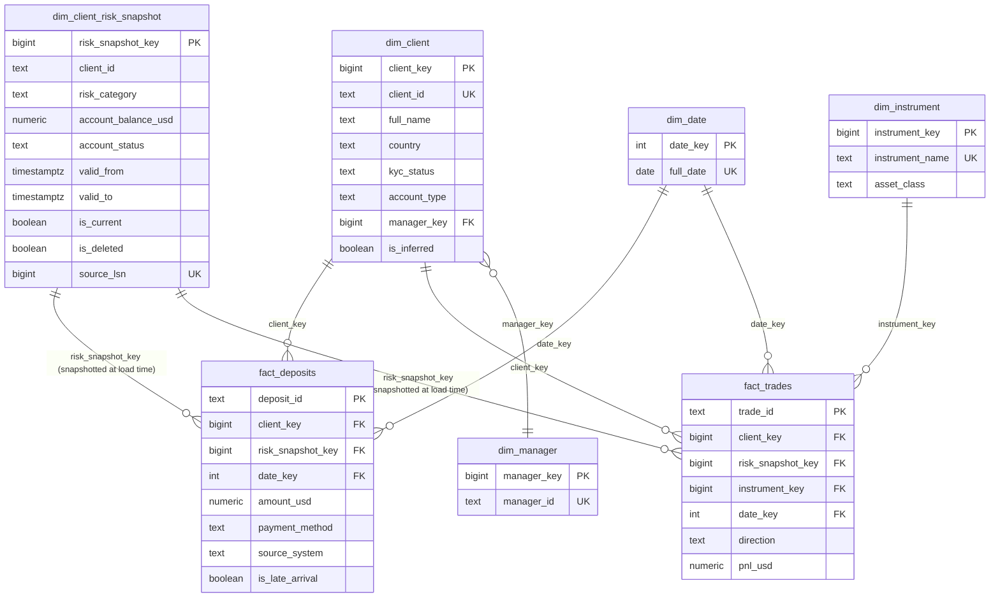

# Part 2 — Data Model & Historization

SQL referenced below lives in [`sql/`](sql/): [`01_dimensions.sql`](sql/01_dimensions.sql),
[`02_facts.sql`](sql/02_facts.sql), [`03_cdc_apply.sql`](sql/03_cdc_apply.sql),
[`04_backfill_reset.sql`](sql/04_backfill_reset.sql).

---

## 2a. Dimensional Model / ERD

**Approach: Kimball star schema.** At 30 clients and a handful of fact sources, a Data Vault's
hub/satellite/link normalization buys auditability this dataset's scale doesn't need, and
adds joins a BI consumer would have to fight through for no analytical benefit. A star
schema's grain-per-fact-table and denormalized dimensions are the right fit for
straightforward "deposits/trades by client, by date, by instrument" reporting.

### Facts (grain stated per table)

| Fact table | Grain | Source |
|---|---|---|
| `fact_deposits` | **One row per deposit** (`deposit_id`) | `client_deposit.json` (`source_system='internal'`) + vendor CSV feed (`source_system='vendor'`) — both land in the same table so the Part 1 reconciliation job can diff them |
| `fact_trades` | **One row per trade** (`trade_id`) | `client_trades.json` |

### Dimensions

| Dimension | Type | Notes |
|---|---|---|
| `dim_client` | SCD Type 1 | Static/rarely-changing attributes (`country`, `nationality`, `kyc_status`, `signup_platform`, etc.), merged from `client_signup` + `client_profile`'s non-volatile columns (both 1:1 on `client_id`). Carries `is_inferred` for late-arriving stubs. |
| `dim_client_risk_snapshot` | **SCD Type 4** mini-dimension, versioned **SCD Type 2** internally | The 3 CDC-tracked volatile attributes (`risk_category`, `account_balance_usd`, `account_status`), split out so `dim_client` doesn't grow a full-width row on every balance change. |
| `dim_manager` | Thin standalone dimension | `assigned_manager` (MGR01–MGR04) — a real business entity, not a fixed-value tag, so given its own table even though it's currently just an ID. |
| `dim_instrument` | Standard dimension | One row per traded instrument + `asset_class` (FX/Commodity/Crypto/Index) for exposure rollups. |
| `dim_date` | Standard generated dimension | Not sourced from input files. |

`payment_method`, `currency_original`, deposit `status`, trade `direction`, and `trade_status`
are kept as **degenerate dimensions** — plain columns on the fact rows — since they're pure
fixed-value tags with nothing else attached to them; a separate dimension table would add a
join with no analytical benefit today.

### ERD

### Fact-to-risk-snapshot join strategy: snapshotted FK at load time

Rather than joining `fact_deposits`/`fact_trades` to `dim_client_risk_snapshot` dynamically
via `BETWEEN valid_from AND valid_to` at query time, the FK is **resolved once, at ETL load
time**, via `warehouse.resolve_risk_snapshot_key(client_id, event_ts)`
([`03_cdc_apply.sql`](sql/03_cdc_apply.sql)), and stored directly on the fact row. This
matches Kimball's own stated guidance: *"the surrogate join key between facts and dimensions
[is] meant to be temporal... will always select the correct dimension at a point in time (no
'between' clause needed)."* It removes an entire category of query-time bugs — a
query-writer forgetting the range condition and silently joining to the *current* risk
profile instead of the historically-correct one — at the cost of one lookup per row during
ETL, which the pipeline is already doing for the inferred-member resolution below.

*(A more advanced variant, SCD Type 7 "dual surrogate keys" — storing both a point-in-time
key and a durable "always-current" key on the fact row — was considered for retroactive
fraud re-screening use cases, but rejected for now as more complexity than this assignment's
scope requires. The single snapshotted key is the simpler, sufficient choice.)*

### Late-arriving dimension members

`deposits_vendor_20240303.csv` (`CL099`) and `client_deposit.json` (`CL031`) both have
deposits with no matching `client_signup`/`client_profile` row. Rather than quarantining the
fact row (which would make real money disappear from the ledger) or pointing every unknown
client at one shared sentinel key (which loses per-client attribution), the pipeline uses the
**inferred-member pattern**: at fact-load time, if no `dim_client` row exists for a
`client_id`, insert a stub (`client_id` populated, all other attributes `NULL`, `is_inferred
= true`), so the FK holds. If `client_signup` later delivers a real record for that client, an
`UPDATE ... WHERE is_inferred = true` backfills the real attributes in place — no fact rows
need to change, since they already point at the correct `client_key`. Inferred members are
also surfaced in the Part 1a.5 "orphan clients" daily report for manual confirmation.

---

## 2b. Historization (SCD)

### 1. SCD type and trade-offs

**SCD Type 2**, applied via a **Type 4 mini-dimension split** (see 2a): `risk_category`,
`account_balance_usd`, and `account_status` get their own versioned table rather than
living in the same wide row as `full_name`/`nationality`/etc.

- **Why not Type 1** (overwrite)? It destroys the audit trail entirely — explicitly
  disqualified by the assignment's constraint, and pointless for compliance-relevant fields
  like risk category.
- **Why not Type 3** (previous-value column)? The CDC data shows multiple same-day changes
  per client (`CL001` changes at `lsn 1004`, `1005`, and `1006` within a few hours on
  2024-11-15) — a single "previous value" column can't represent a 3-deep change history.
- **Trade-off of Type 2 + mini-dimension**: every attribute change creates a new row, so a
  volatile field like `account_balance_usd` (which could change on every trade in a live
  system) would grow the dimension quickly if it weren't split out — which is exactly why
  the split exists. The cost is an extra join (two dimension tables instead of one) for any
  query that needs both static and volatile client attributes together.

### 2. Update and delete handling — merge/upsert walkthrough

Implemented in [`warehouse.apply_cdc_event()`](sql/03_cdc_apply.sql), called once per CDC
event by Airflow:

1. **Watermark check** — reject (quarantine, `INFO` severity) any event whose `lsn` is
   `<=` that client's `cdc_watermark.last_applied_lsn`. This is the sole ordering
   guarantee (Part 1 §1); no batch-level sort is performed.
2. **End-date the current version** — `UPDATE ... SET valid_to = commit_ts, is_current =
   false WHERE client_id = ... AND is_current = true`.
3. **`insert`/`update`** — append a new version row with the event's `after` values,
   `valid_from = commit_ts`, `is_current = true`. `ON CONFLICT (client_id, source_lsn) DO
   NOTHING` guards against replaying the same event twice.
4. **`delete`** — instead of step 3, append a **terminal tombstone row**: copies the last
   known `risk_category`/`account_balance_usd`, sets `account_status = 'deleted'`,
   `is_deleted = true`, `is_current = true`, `valid_to = '9999-12-31'`. Nothing is ever
   physically removed from the table — satisfying the assignment's hard constraint against
   hard deletes.
5. **Advance the watermark last** — after the row is committed, not before, so a mid-function
   failure never advances the watermark past an event that wasn't actually applied.

Trade-off of the tombstone approach: every "current state" query must remember a `WHERE
is_deleted = false` filter, or deleted clients silently leak into aggregates like "count of
active clients." The alternative (end-date only, no tombstone) avoids that filter but makes
"deleted" indistinguishable from "row not loaded yet" — unacceptable alongside the
inferred-member pattern, which already produces sparse-attribute rows for a different reason.

### 3. Reloading a historical date range (e.g. November 2024) without corrupting history

A plain Airflow backfill (re-triggering November's DAG runs) is **not sufficient by itself**:
`apply_cdc_event`'s watermark check and `ON CONFLICT ... DO NOTHING` are both deliberately
idempotent, which means every already-applied `lsn` in November is rejected as stale before
it can correct anything. The actual reload mechanism ([`04_backfill_reset.sql`](sql/04_backfill_reset.sql)):

1. **Identify affected clients and their reset point** — query `raw.client_profile_changes`
   (retained indefinitely) for `commit_ts` in the target range, grouped by `client_id`, to
   get the earliest `lsn` each affected client needs replayed from.
2. **Reset each client individually** via `reset_client_for_reload(client_id, from_lsn)`:
   deletes that client's `dim_client_risk_snapshot` rows from `from_lsn` onward, reactivates
   whichever version was current immediately before that point (preserving its own
   `is_deleted` state), and rolls `cdc_watermark.last_applied_lsn` back to `from_lsn - 1`.
   **Scoped per-client, not blanket** — resetting everyone touched anywhere in November would
   also discard already-correct history for clients whose data didn't actually need fixing.
3. **Replay** — Airflow re-runs `apply_cdc_event` for each affected client's events from
   `raw.client_profile_changes`, in `lsn` order, from the reset point forward. Because
   `raw` is immutable and retained indefinitely, this replay is always possible regardless of
   how long ago November was.

This mechanism explicitly handles (see also the design-interview log in
[`PROMPTS.md`](PROMPTS.md)):
- **A corrected value for an already-applied `lsn`** (upstream fixes bad data and redelivers
  the same `lsn`) — the reset makes the watermark accept the correction instead of rejecting
  it as stale.
- **A bug in the apply logic itself** — fixing the code doesn't retroactively fix loaded
  rows; the reset+replay regenerates them under the corrected logic.
- **Delete-tombstone interaction** — if `CL012`'s delete (`lsn 1010`) falls inside the reload
  window, replaying the **full event sequence** (not just updates) prevents the reload from
  silently reappearing a client that was correctly deleted.
- **Per-client scoping** — a targeted reset means fixing one client's bad November data never
  touches another client's already-correct history, even if both were active in November.
