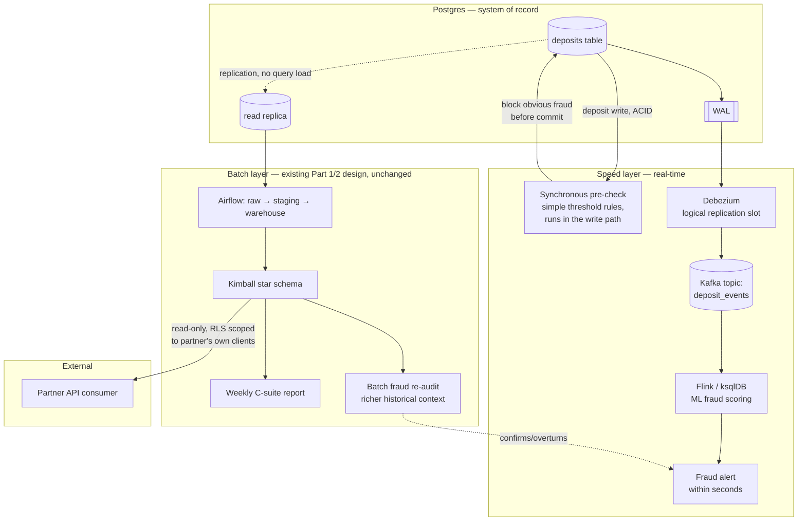

# Part 3 — TL Extension

## 3a. Unified Real-Time and Batch Architecture

**Requirement:** a fraud-detection signal must fire within seconds of a deposit, while the
existing batch pipeline (Parts 1-2) continues serving the weekly C-suite report, and an
external partner API consumes the data too.

### Tooling choice: Debezium → Kafka → Flink/ksqlDB, Lambda-style

**Why this stack:** Debezium reads Postgres's WAL directly via a logical replication slot —
it imposes no additional query load on the OLTP tables, so it structurally cannot compete
with the batch pipeline's extracts for locks or I/O. This is the deliberate TL-level choice
over two simpler-looking alternatives: `LISTEN/NOTIFY` is fire-and-forget (no replay if a
consumer is down during exactly the kind of incident you'd want the fraud signal for), and
application-level dual-writing to both Postgres and Kafka risks the two falling out of sync
unless a transactional outbox pattern is built anyway — which is extra engineering to
reinvent what Debezium already does off the WAL for free.

### How real-time and batch coexist without blocking each other

**Lambda architecture, both paths reading the same Postgres source independently:**

- The **existing Airflow batch pipeline is untouched** — it still populates `warehouse.*` on
  schedule, exactly as designed in Parts 1-2.
- The **real-time path taps the WAL**, not the tables — Debezium's replication slot is a
  fundamentally different read mechanism from a `SELECT`-based extractor, so it cannot
  contend with batch queries for row locks or buffer cache.
- **Batch extracts run against a read replica**, not the primary, as a second layer of
  insulation — even a heavy weekly-report query can't slow down a live deposit write.
- The two paths aren't just non-blocking, they're **complementary**: the speed layer
  (Flink) makes a fast decision on partial/streaming context, and the batch layer later
  **re-audits** flagged (and unflagged) transactions with the full historical context only a
  warehouse query can provide — a dual-check pattern used in production fraud systems, where
  the batch pass can confirm or overturn the speed layer's initial call.

### Latency vs. consistency — where eventual consistency is accepted

| What | Consistency guarantee | Why |
|---|---|---|
| The deposit write itself | **Strongly consistent, ACID** | Committed to Postgres synchronously before Debezium even sees it — the source of truth is never eventually consistent. |
| Synchronous pre-check (simple rules) | **Strongly consistent** | Runs in the write path itself; blocks the commit for obvious, cheap-to-evaluate fraud (e.g. amount/velocity thresholds) before it ever happens. |
| Flink ML fraud score | **Eventually consistent, by design** | Sub-second to a few seconds of lag (WAL replication + stream processing time) is the deliberate trade for not adding ML-inference latency to every deposit's critical path. |
| Weekly batch report / partner API view | **Eventually consistent, coarser** | Hours of lag via replica replication + Airflow schedule — an inherent property of any batch architecture, not a new trade-off introduced here. |

A production system with a hard SLA (e.g., a maximum fraud-alert latency for high-risk
clients specifically) could tier this further by routing only those clients' events through
a stricter, lower-latency Flink job — not implemented here, but a natural extension of the
same architecture.

**Real-world validation:** production fraud pipelines on this exact stack report end-to-end
latency (ingestion → risk classification) consistently under 250-300ms even at load, and
research on synchronous-rule + asynchronous-ML hybrids specifically flags the *gap* between
the two checks as an exploitable window if the synchronous layer is skipped — which is why
the pre-check above sits in the write path itself, not as a second async consumer.

### External API consumer — consistent, secure view

- **Reads from the batch warehouse only** — never directly from Kafka/Flink or the OLTP
  primary. This guarantees the partner always sees a **stable, point-in-time-consistent
  snapshot**: every field reflects the same refresh cycle, with no risk of reading a deposit
  that hasn't finished fraud-scoring or a partially-applied SCD2 update mid-transaction.
- **Security**: a dedicated read-only Postgres role scoped to specific warehouse views (never
  raw tables), with **row-level security** filtering every query to that partner's own
  `client_id`s — so a compromised or misconfigured partner integration cannot see another
  partner's clients. Credentials are per-partner (API keys/OAuth, not shared), rotated via a
  secrets manager, all access over TLS.

---

## 3b. Build vs. Buy

**Scenario:** onboarding a new third-party payment processor, similar in shape to the vendor
CSV feed already modeled in Part 1 (which already showed real integration pain: a renamed
column, late/back-dated deliveries, a malformed row).

### Decision criteria

1. **Undifferentiated vs. differentiated work** — is extraction/scheduling/auth/schema-drift
   handling something a tool already solves well, vs. is the validation/reconciliation logic
   specific to this business (no platform ships "negative deposit amounts are CRITICAL" out
   of the box)?
2. **Rate of new sources** — onboarding one processor differs from onboarding one per quarter.
3. **Total cost of ownership** — engineering time to build+maintain a custom connector vs.
   platform licensing cost at this data volume.
4. **Compliance/data residency** — can a third-party SaaS touch financial PII, or must
   everything stay in-house?
5. **What's actually available out-of-the-box for *this specific* processor** — does the
   chosen tool's connector library already cover this processor's auth method and delivery
   protocol with zero custom code, or would you be fighting the tool as much as writing one?

### Recommendation for this case: Meltano for extraction, Great Expectations for validation — conditional on true zero-engineering fit

Rejected **Fivetran** specifically on cost — at this data volume (30 clients, a handful of
daily files), a per-connector SaaS subscription is disproportionate to the problem size.
Instead:

- **Meltano** (open-source, self-hosted EL framework) for the extraction/scheduling
  layer — **conditional**: use it only if this processor's specific auth method and delivery
  protocol are already covered by an existing Meltano/Singer tap with no custom code required.
  If they are, Meltano lands data into `raw` exactly as Part 1 already designed, at zero
  licensing cost and no new infrastructure paradigm (still self-hosted, still your
  infrastructure).
- **Great Expectations** for all validation from that point forward — the *same* framework
  already retrofitted into Part 1's data-quality layer (see `part1_pipeline.md` §5). A new
  processor gets a new Expectation Suite YAML file, not a new validation paradigm.
- **100% custom build, regardless of the above, for**: the `staging → quarantine →
  warehouse` reconciliation logic (late-arrival detection, orphan-client resolution,
  watermarking) — this is where the actual business-specific value and compliance risk sits,
  and it's identical work whether the extraction layer is Meltano or a bespoke script.

**The actual build-vs-buy line, restated:** *buy* (or rather, adopt open-source tooling for)
the parts that are genuinely undifferentiated — pulling bytes from an SFTP/API on a schedule,
retrying on failure, mapping known schema variants — and *build* everything downstream that
encodes this business's specific judgment about what "good data" means. This isn't a binary
per-vendor decision; it's a layered one, decided per capability rather than per vendor.

**What would change the recommendation:**
- If this specific processor requires **non-standard auth** (e.g. mTLS with a proprietary
  certificate format) or a **protocol with no existing Meltano/Singer tap**, custom build for
  extraction becomes the only real option — the "zero extra engineering" condition fails, and
  a partial Meltano integration that still needs a custom auth plugin has given up most of
  the cost benefit anyway.
- If onboarding rate increases substantially (multiple processors per quarter), it's worth
  revisiting whether a paid platform's connector library breadth starts to outweigh its cost
  — the calculus in this recommendation is specific to *one* processor, onboarded now, at
  this data volume.
